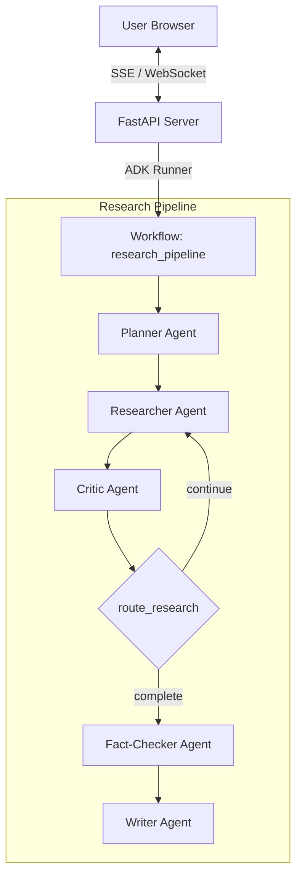

# Multi-Agent Research Assistant

A system where 5 specialized AI agents collaborate to produce comprehensive, cited research reports on any topic. Built with Google ADK, Gemini, and FastAPI.


---

## Architecture



### Agent Roles

| Agent | Model | Role |
|-------|-------|------|
| **Planner** | Gemini 2.5 Pro | Decomposes topic into sub-questions and research plan |
| **Researcher** | Gemini 2.5 Flash | Searches web, reads documents, gathers findings |
| **Critic** | Gemini 2.5 Flash | Reviews findings for gaps, decides if more research needed |
| **Fact-Checker** | Gemini 2.5 Flash | Verifies claims against independent sources |
| **Writer** | Gemini 2.5 Pro | Synthesizes findings into a polished, cited report |

The Researcher and Critic work in a loop (max 3 iterations) — the Critic reviews findings and either requests more research or signals completion.

---

## Features

- **5 Specialized Agents** — each with distinct tools and prompts
- **Iterative Research Loop** — Researcher-Critic loop with automatic convergence
- **Fact-Checking** — independent verification of key claims
- **Web Search** — Tavily (primary) with DuckDuckGo fallback (no API key needed)
- **Document Parsing** — PDF and web page content extraction
- **Real-time Streaming** — SSE-based agent activity feed
- **Approval Mode** — optional human-in-the-loop gates
- **Evaluation Framework** — LLM-as-judge with 4-dimension rubric
- **Export** — Markdown and PDF report download

---

## Setup and Installation

### Prerequisites

- Python 3.10+
- [uv](https://docs.astral.sh/uv/) (recommended) or pip / virtualenv

### Ingesting Dependencies

Using **uv** (recommended):
```bash
# Clone the repository
git clone https://github.com/arman1o1/multi-agent-research-assistant.git
cd multi-agent-research-assistant

# Sync virtual environment and install dependencies
uv sync
```

Using standard **pip** and **venv**:
```bash
# Clone the repository
git clone https://github.com/arman1o1/multi-agent-research-assistant.git
cd multi-agent-research-assistant

# Create and activate virtual environment
python -m venv .venv
source .venv/bin/activate  # On Windows: .venv\Scripts\activate

# Install dependencies
pip install .
```

### Configuration

Copy the example environment file and configure your API keys:
```bash
cp .env.example .env
```
Edit `.env` and configure:
- `GOOGLE_API_KEY` (Required)
- `TAVILY_API_KEY` (Optional, falls back to DuckDuckGo if missing)

---

## Running the Application

To start the FastAPI web server:
```bash
# Using uv
uv run python -m src.api.server

# Using standard Python
python -m src.api.server
```
Once started, open `http://localhost:8000` in your web browser to access the frontend dashboard.

### CLI and Alternative Interfaces

You can also run the agent pipeline directly in the terminal or use ADK's built-in UI:
```bash
# Terminal-based interaction
uv run adk run src.agents

# ADK's built-in web UI
uv run adk web src.agents
```

---

## Testing

To run the unit tests for the tools, agents, and API server:
```bash
# Run all tests using pytest
uv run pytest
```

To run a specific test suite:
```bash
# Run tool tests
uv run pytest tests/test_tools.py

# Run agent creation tests
uv run pytest tests/test_agents.py

# Run API tests
uv run pytest tests/test_api.py
```

---

## Evaluation

The evaluation framework uses LLM-as-judge to score reports on 4 dimensions:

| Dimension | What It Measures |
|-----------|-----------------|
| **Factual Accuracy** | Are claims supported by cited sources? |
| **Comprehensiveness** | Does the report cover the topic thoroughly? |
| **Coherence** | Is the report well-structured and logical? |
| **Citation Quality** | Are sources diverse, reliable, and properly attributed? |

To run the evaluation benchmarks:
```bash
# Run on all benchmark topics
uv run python -m src.eval.benchmark

# Run on a specific complexity level
uv run python -m src.eval.benchmark --complexity medium

# Run specific topics by index
uv run python -m src.eval.benchmark --indices 0 1 2
```

---

## Project Structure

```
├── pyproject.toml              # Dependencies & project config
├── .env.example                # API key template
├── src/
│   ├── config.py               # Settings (Pydantic)
│   ├── agents/
│   │   ├── planner.py          # Topic decomposition
│   │   ├── researcher.py       # Web research + document reading
│   │   ├── critic.py           # Quality review + loop control
│   │   ├── fact_checker.py     # Claim verification
│   │   ├── writer.py           # Report synthesis
│   │   └── pipeline.py         # SequentialAgent + LoopAgent assembly
│   ├── tools/
│   │   ├── search.py           # Tavily + DuckDuckGo fallback
│   │   ├── documents.py        # PDF + webpage parsing
│   │   └── state_tools.py      # State helpers + escalation
│   ├── api/
│   │   ├── server.py           # FastAPI + SSE + WebSocket
│   │   ├── runner.py           # ADK Runner wrapper
│   │   └── export.py           # Markdown → PDF
│   ├── frontend/
│   │   ├── index.html          # SPA
│   │   ├── styles.css          # Dark glassmorphism theme
│   │   └── app.js              # SSE client + UI logic
│   └── eval/
│       ├── evaluator.py        # LLM-as-judge
│       ├── benchmark.py        # Batch evaluation runner
│       └── topics.json         # 24 benchmark topics
└── tests/
    ├── test_tools.py           # Tool unit tests
    ├── test_agents.py          # Agent config tests
    └── test_api.py             # API endpoint tests
```

---

## Tech Stack

| Component | Technology |
|-----------|-----------|
| Agent Orchestration | Google ADK 2.2.0 |
| LLM | Gemini 2.5 Pro / Flash |
| Web Search | Tavily / DuckDuckGo |
| Document Parsing | PyMuPDF, Trafilatura |
| State Persistence | SQLite (via aiosqlite) |
| Backend | FastAPI + Uvicorn |
| Frontend | Vanilla HTML/CSS/JS |
| PDF Export | fpdf2 |
| Evaluation | LLM-as-judge (Gemini) |

---

## License

MIT
